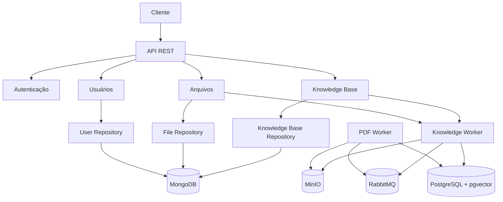
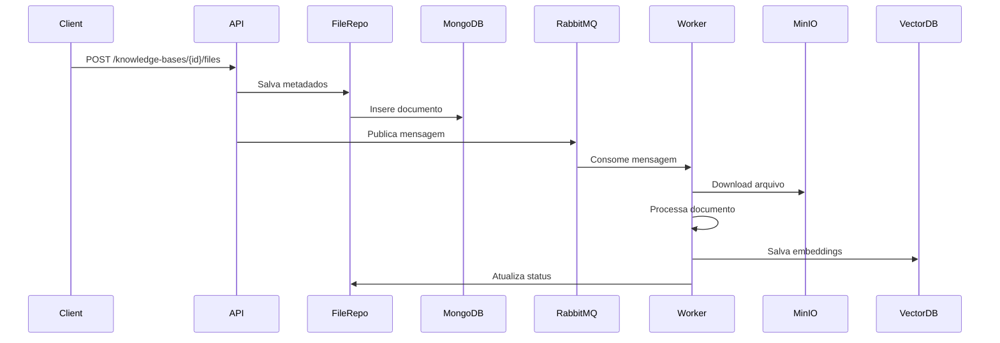
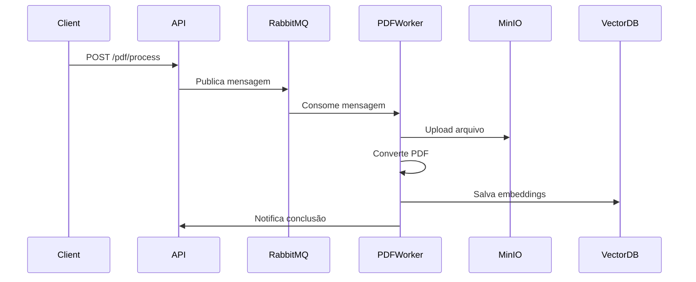

# Arquitetura do Sistema

## Visão Geral

O sistema é construído seguindo uma arquitetura em camadas, com separação clara de responsabilidades e princípios SOLID. A arquitetura é projetada para ser escalável, manutenível e testável.

## Diagrama de Arquitetura

## Camadas da Aplicação

### 1. API Layer (src/api)
- **Responsabilidade**: Exposição de endpoints REST
- **Componentes**:
  - `v1/`: Versionamento da API
  - `dependencies/`: Injeção de dependências
  - `middleware/`: Middlewares (auth, logging, etc)
  - `models/`: Schemas Pydantic
  - `endpoints/`: Rotas da API

### 2. Core Layer (src/core)
- **Responsabilidade**: Lógica de negócio
- **Componentes**:
  - `usecases/`: Casos de uso
  - `services/`: Serviços de domínio
  - `repositories/`: Repositórios
  - `models/`: Modelos de domínio
  - `exceptions/`: Exceções customizadas

### 3. Infrastructure Layer (src/infrastructure)
- **Responsabilidade**: Implementações técnicas
- **Componentes**:
  - `config/`: Configurações
  - `database/`: Conexões com banco
  - `logging/`: Configuração de logs
  - `storage/`: Armazenamento (MinIO)
  - `messaging/`: Mensageria (RabbitMQ)

### 4. Workers (src/workers)
- **Responsabilidade**: Processamento assíncrono
- **Componentes**:
  - `knowledge_worker.py`: Processamento de documentos
  - `pdf_worker.py`: Processamento de PDFs

## Padrões de Projeto

### 1. Repository Pattern
- **Objetivo**: Abstrair acesso a dados
- **Implementação**: Classes em `src/core/repositories/`
- **Benefícios**:
  - Desacoplamento da lógica de negócio
  - Facilita testes unitários
  - Centraliza operações de banco

### 2. Service Layer Pattern
- **Objetivo**: Encapsular lógica de negócio
- **Implementação**: Classes em `src/core/services/`
- **Benefícios**:
  - Separação de responsabilidades
  - Reutilização de código
  - Facilita manutenção

### 3. Factory Pattern
- **Objetivo**: Criação de objetos complexos
- **Implementação**: Funções em `src/infrastructure/factories/`
- **Benefícios**:
  - Encapsula lógica de criação
  - Facilita configuração
  - Melhora testabilidade

### 4. Strategy Pattern
- **Objetivo**: Algoritmos intercambiáveis
- **Implementação**: Classes em `src/core/strategies/`
- **Benefícios**:
  - Flexibilidade
  - Extensibilidade
  - Facilita testes

## Fluxo de Dados

### 1. Upload de Documento

### 2. Processamento de PDF

## Persistência de Dados

### 1. MongoDB
- **Uso**: Dados de domínio
- **Coleções**:
  - `knowledgebases`: Bases de conhecimento
  - `bucketfiles`: Arquivos processados
  - `users`: Usuários do sistema

### 2. PostgreSQL + pgvector
- **Uso**: Armazenamento de embeddings
- **Tabelas**:
  - `document_embeddings`: Embeddings de documentos
  - `chunk_embeddings`: Embeddings de chunks

### 3. MinIO
- **Uso**: Armazenamento de arquivos
- **Buckets**:
  - `documents`: Arquivos originais
  - `processed`: Arquivos processados

## Mensageria

### RabbitMQ
- **Exchanges**:
  - `knowledge`: Processamento de documentos
  - `pdf`: Processamento de PDFs
- **Queues**:
  - `knowledge.processing`: Fila de processamento
  - `pdf.processing`: Fila de PDFs

## Segurança

### 1. Autenticação
- JWT (JSON Web Token)
- Refresh tokens
- Expiração configurável

### 2. Autorização
- RBAC (Role-Based Access Control)
- Permissões granulares
- Middleware de verificação

### 3. Proteção de Dados
- Criptografia em trânsito (HTTPS)
- Sanitização de inputs
- Validação de dados

## Monitoramento

### 1. Logging
- Logs estruturados (JSON)
- Níveis configuráveis
- Rastreamento de requisições

### 2. Métricas
- Prometheus metrics
- Endpoints de health check
- Métricas de performance

### 3. Tracing
- OpenTelemetry
- Rastreamento distribuído
- Análise de performance

## Escalabilidade

### 1. Horizontal
- Múltiplas instâncias da API
- Workers escaláveis
- Load balancing

### 2. Vertical
- Otimização de queries
- Caching
- Connection pooling

### 3. Caching
- Redis para cache
- Cache de embeddings
- Cache de configurações

## Considerações de Implementação

### 1. Performance
- Processamento assíncrono
- Batch processing
- Otimização de queries

### 2. Manutenibilidade
- Código modular
- Documentação clara
- Testes automatizados

### 3. Observabilidade
- Logs estruturados
- Métricas detalhadas
- Alertas configuráveis

### 4. Segurança
- Validação de inputs
- Sanitização de dados
- Proteção contra ataques

## Próximos Passos

1. **Melhorias de Performance**
   - Implementar cache distribuído
   - Otimizar queries
   - Adicionar índices

2. **Monitoramento**
   - Dashboard de métricas
   - Alertas automáticos
   - Log aggregation

3. **Segurança**
   - Auditoria de segurança
   - Penetration testing
   - Compliance checks

4. **Documentação**
   - Documentação de API
   - Guias de desenvolvimento
   - Runbooks operacionais 